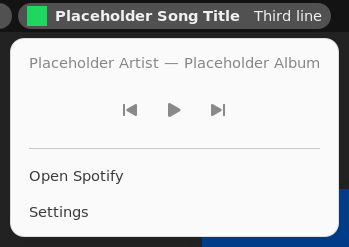

# Spotify Top Bar Lyrics (Ubuntu / GNOME)


*Shown with placeholder song and lyric text.*

> This branch is the Ubuntu / GNOME version. The Windows 11 taskbar widget is on the
> [`main` branch](https://github.com/melementi/SpotifyTaskbarWidget/tree/main).

A GNOME Shell extension that puts the song Spotify is playing into the Ubuntu top bar:

- the album cover and the song title
- beside them, one line of the song's lyrics: the line being sung right now, synced to the music

It needs no Spotify login and no API key. The song comes from Spotify's own media controls (MPRIS), and the
lyrics come from [LRCLIB](https://lrclib.net), a free public lyrics database.

Click it for the artist and album, previous / play-pause / next buttons, **Open Spotify** and **Settings**.



## Requirements

- Ubuntu 23.10 or newer with the standard Ubuntu desktop, or any Linux desktop running GNOME Shell 45 to 51.
  Ubuntu 24.04 LTS (GNOME 46), 24.10, 25.04, 25.10 and 26.04 (GNOME 50) all qualify. Ubuntu 22.04 (GNOME 42) is too old.
- The Spotify desktop app, from the App Center (Snap), Flathub or Spotify's own `.deb` repository.
- An internet connection for lyrics and covers.

## Install

The extension installs for your user only. No administrator rights are needed, and nothing outside your home
folder is changed.

### Before you start

1. Check your GNOME version. Open a terminal (**Ctrl + Alt + T**) and run:

   ```sh
   gnome-shell --version
   ```

   It must print `GNOME Shell 45` or newer, up to `51`.

2. Make sure the two tools the installer uses are present. Both come with the standard Ubuntu desktop, so on
   Ubuntu this step can usually be skipped:

   ```sh
   gnome-extensions version && glib-compile-schemas --version
   ```

   If either is missing, install it: on Ubuntu / Debian `sudo apt install gnome-shell libglib2.0-bin`, on
   Fedora `sudo dnf install gnome-shell glib2`, on Arch `sudo pacman -S gnome-shell glib2`.

### Install steps

1. Download this branch (not `main`, which is the Windows version). Either:

   - with git (install it first with `sudo apt install git` if needed):

     ```sh
     git clone -b Ubuntu-Gnome-top-bar-version https://github.com/melementi/SpotifyTaskbarWidget
     cd SpotifyTaskbarWidget
     ```

   - or without git: on GitHub switch the branch selector to `Ubuntu-Gnome-top-bar-version`, choose
     **Code → Download ZIP**, unzip it, then open a terminal in the unzipped folder.

2. Run the installer from that folder:

   ```sh
   sh install.sh
   ```

   It compiles the settings schema, packs the extension into `dist/`, installs it into
   `~/.local/share/gnome-shell/extensions/spotify-top-bar-lyrics@melementi.github.io` and turns it on.

3. **Log out and back in.** On Wayland (the Ubuntu default) GNOME only loads newly installed extensions at
   login. The installer has already set the extension to start at that login.

4. Start Spotify and play a song. The cover, title and current lyric line appear at the left of the top bar,
   next to the workspace indicator. The item hides itself whenever Spotify is closed or has nothing loaded.

### Check that it is running

After logging back in, run:

```sh
gnome-extensions info spotify-top-bar-lyrics@melementi.github.io
```

The output should show `Enabled: Yes` and `State: ACTIVE`. You can also see and toggle it in the **Extensions**
app.

### If it does not appear

- `State: INACTIVE` or `Enabled: No`: turn it on with
  `gnome-extensions enable spotify-top-bar-lyrics@melementi.github.io`, or with the switch in the **Extensions**
  app.
- `State: OUT OF DATE`: your GNOME version is outside 45 to 51, which this extension does not support.
- `State: ERROR`: check the log with `journalctl -b -o cat /usr/bin/gnome-shell | grep -i spotify` and open an
  issue with what it shows.
- `Extension ... doesn't exist`: you have not logged out and back in since installing.
- Nothing in the top bar while the extension is active: make sure a song is loaded in the Spotify desktop app
  (the web player is not supported).

### Update

Get the new version (`git pull` in the cloned folder, or download the ZIP again) and run `sh install.sh` again,
then log out and back in. Your settings and cached lyrics are kept.

## Settings

Open them from the item's menu (**Settings**), or from the **Extensions** app.

| Setting | Default | Meaning |
|---|---|---|
| Top bar section | Left | Left (after the workspace indicator), center (beside the clock) or right (beside the system menu). |
| Place within the section | -1 | 0 puts the song first in its section, -1 last. |
| Widest song title | 200 | In pixels. Longer titles end in "…". |
| Widest lyric line | 420 | In pixels. Longer lines end in "…". |
| Lyric offset | 0 | In milliseconds. Positive values show lyrics earlier, negative values later. |

Lyric messages you may see in place of a line:

| Message | Meaning |
|---|---|
| `No synced lyrics` | LRCLIB has no timed lyrics for this song. |
| `♪ Instrumental` | The song is marked instrumental. |
| `Lyrics unavailable` | LRCLIB could not be reached; the next song tries again. |

Downloaded lyrics are cached in `~/.cache/spotify-top-bar-lyrics/lyrics`. Delete that folder to download them
again.

## Uninstall

```sh
gnome-extensions uninstall spotify-top-bar-lyrics@melementi.github.io
rm -rf ~/.cache/spotify-top-bar-lyrics
```

## Develop

The extension is plain JavaScript (GJS, ES modules); there is nothing to compile.

- `extension/extension.js` — entry point: creates the model and puts the item in the top bar.
- `extension/lib/nowPlaying.js` — follows Spotify over D-Bus (MPRIS), keeps the playback clock and picks the
  lyric line for the moment.
- `extension/lib/indicator.js` — the top bar item and its menu.
- `extension/lib/services.js` — HTTP (libsoup), the lyrics cache on disk and cover downloads.
- `extension/lib/lyrics.js`, `lrclib.js`, `clock.js`, `metadata.js` — LRC parsing, LRCLIB matching, playback
  timing and metadata reading. They have no GNOME imports, so the tests run them under Node.
- `extension/prefs.js` and `extension/schemas/` — the settings window and its keys.

Run the tests (Node.js 20 or newer):

```sh
npm test
```

To try a change, run `sh install.sh` and log out and back in. To watch the extension's log:

```sh
journalctl -f -o cat /usr/bin/gnome-shell
```

## How it works

Spotify on Linux publishes what it plays on the session D-Bus as `org.mpris.MediaPlayer2.spotify`. The
extension watches that name for the title, artist, length, cover address and play state. MPRIS does not
announce the playback position as it advances, so the extension asks for it on track changes, pauses and seeks,
and every few seconds while lyrics are showing, and counts forward in between. The line changes are timed to
the millisecond rather than polled.

Lyrics are looked up on LRCLIB by title, artist and length; when there is no exact match it searches, then
retries with the title stripped of suffixes such as "- Remastered 2011" and with only the first artist.

## Privacy

- No telemetry, no account, no API key.
- LRCLIB receives the title, artist and length of each new song, over HTTPS.
- Covers are downloaded from Spotify's image server (`i.scdn.co`), the address Spotify itself reports.
- Lyrics found are cached on disk under `~/.cache/spotify-top-bar-lyrics`; covers are only kept in memory.

## Limits

- Spotify only.
- Shows on the main monitor's top bar only.
- Songs LRCLIB does not have show no lyrics.
- It is hidden on the lock screen.

## Disclaimer

This is an unofficial hobby project. It is not affiliated with, endorsed by or connected to Spotify AB. Lyrics
are provided by LRCLIB and its contributors.

## License

[MIT](LICENSE)
